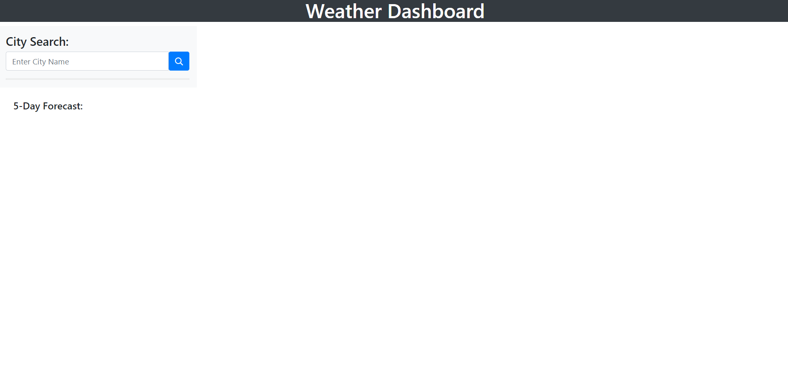
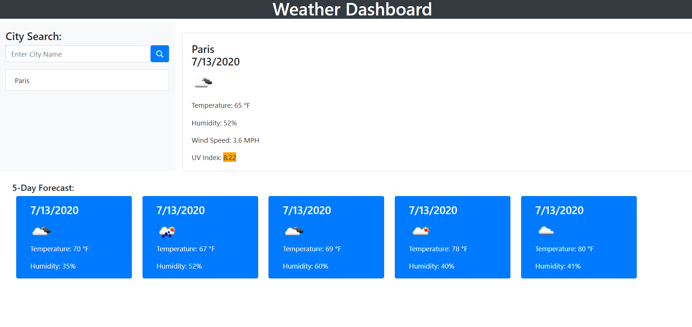
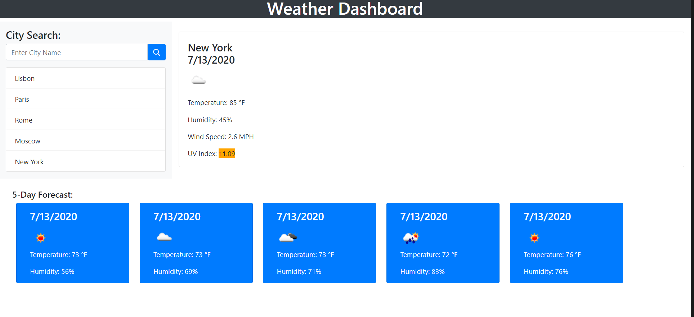

# Weather-Dashboard
The given assignment was to create a weather dashboard utilizing the openweather API as well as local storage. Users type in the city they wish to see, and a 5 day forecast will be displayed. The user can coninue to search other cities as they are stored to the side using local storage. 

Users are presnted with the city name, the date, an icon representation of weather conditions, the temperature, the humidity, the wind speed, and the UV index. UV index will change color depending on the levels. Green is favorable, yellow is moderate, and orange is severe. 

The following images display screenshots for the completed project.
Blank Page

Inputed City

Cities stored in local storage

